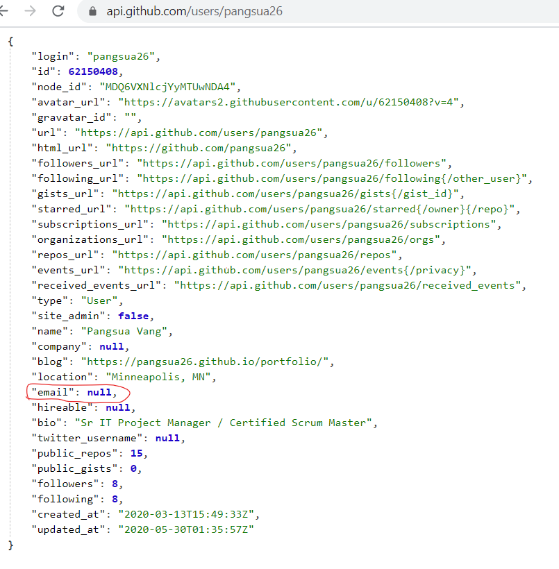
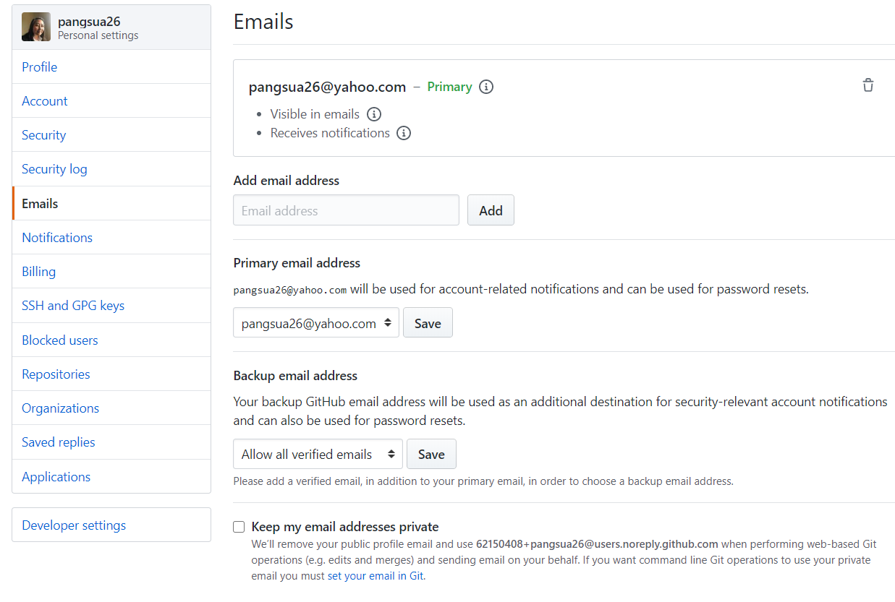

# homework_goodreadme

## Project Description
The purpose of this activity is to create a command-line application that generates a README.md from a user's input. Once the user have answered allt he the command prompts, a new README.md will be created with the following contents:
1. Project title
2. Description
3. Table of Contents
4. Installation
5. Usage
6. License badge
7. Contributing
8. Tests
9. Questions for user GitHub profile picture and email

## The following README video demonstrates the application functionality:
### [README video LINK](https://drive.google.com/file/d/1yvvYVcZxCQbeaRxU_IQK0lW7EHihsnBI/view)

## Experience
I found that starting off was easier than normal thanks to the mini-project activity (prompt) in week 9. The code was also frustrating at times but with a lot searchs and review (previous class activities, Google, YouTube, Dev Moxzilla & Stack Overflow), I was able to mostly work through them.

## Remaining Issue
* Although my email is visible and set in my Github profile to be pangsua26@yahoo.com, the Github API was still pulling a "null" value. I talked to Joe (TA) and we went over my code as well as my Settings in Github and what he could see, and we both couldn't figure out why it was giving me a "null" (i.e. Error: "No email available"). One solution is to hardcode my email address to in `Email: ${user.email}...` to `Email: ${user.pangsua26@yahoo.com}...`. However, since the underline rule is to never hard code unless truely necessary, I am noting it as an open issue.

 
